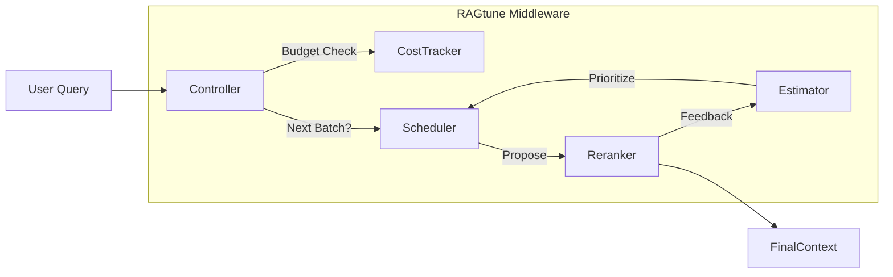

# RAGtune 🎛️

[](https://www.python.org/downloads/)
[](https://opensource.org/licenses/MIT)
[](https://github.com/psf/black)
[]()

**Budget-Aware, Iterative RAG Middleware with Active Learning.**

> **RAGtune** transforms static RAG pipelines into dynamic, cost-sensitive feedback loops. It treats **cost** and **latency** as first-class constraints, optimizing information gain by iteratively sampling and reranking documents based on real-time feedback.

[**Explore Docs**](docs/concepts/architecture.md) · [**View Roadmap**](docs/roadmap.md) · [**Release Notes**](docs/RELEASE_LOG.md)

---

## 🚀 Why RAGtune?

Traditional RAG pipelines are **linear** (Retrieve → Rerank → Generate) and **cost-blind**. They either retrieve too little (missing context) or too much (wasting tokens and latency).

RAGtune introduces an **Active Learning Loop**:

| Feature | Description |
| :--- | :--- |
| **💰 Budget-First** | Define precise budgets for **Token Count**, **Latency (ms)**, and **GPU/API Costs**. The loop stops exactly when the budget is hit. |
| **🔄 Iterative Feedback** | Uses a **Controller** to fetch documents in batches. High-scoring docs boost the priority of similar unranked candidates in real-time. |
| **🧠 Intelligence Layer** | Pluggable **Estimators** (Similarity, Utility) predict which documents are worth paying to rerank next. |
| **🔌 Ecosystem Ready** | Drop-in decorators for **LangChain**, **LlamaIndex**, and **PyTerrier** components. |

---

## 📦 Installation

```bash
# Clone the repository
git clone https://github.com/yourusername/ragtune.git
cd ragtune

# Install in editable mode
pip install -e .
```

---

The fastest way to use RAGtune is via the CLI using declarative **YAML** or **JSON** configurations.

### 1. Initialize a Project
Scaffold a new configuration file with default settings.
```bash
ragtune init
# Created 'ragtune_config.yaml'
```

### 2. Configure Your Pipeline
Edit `ragtune_config.yaml` to define your budget and components.
```yaml
pipeline:
  budget:
    tokens: 4000
    latency_ms: 1500
  components:
    retriever:
      type: "bm25"
    reranker:
      type: "cross-encoder"
```

### 3. Run the Pipeline
Execute the pipeline instantly from the terminal.
```bash
ragtune run ragtune_config.yaml --query "How does Active Learning optimize RAG?"
```

---

## 🛠️ CLI & Configuration

RAGtune is built on a declarative philosophy. Every pipeline, from simple BM25 to complex iterative estimators, can be described in a single file.

### Declarative Pipelines (YAML/JSON)
Whether you prefer the readability of **YAML** or the machine-compatibility of **JSON**, RAGtune supports both.

**YAML Configuration:**
```yaml
# ragtune_config.yaml
pipeline:
  name: "My Pipeline"
  budget: { tokens: 2000 }
  components:
    retriever: { type: "bm25" }
```

**JSON Configuration:**
```json
{
  "pipeline": {
    "name": "My Pipeline",
    "budget": { "tokens": 2000 },
    "components": {
      "retriever": { "type": "bm25" }
    }
  }
}
```

### Visual Inspection
Understand your pipeline flow instantly with ASCII diagrams:
```bash
ragtune visualize ragtune_config.yaml
```

For a full breakdown of all commands (`init`, `index`, `validate`, `run`, `list`, `visualize`) and the v0.2 configuration schema, see the **[CLI Reference Guide](docs/cli.md)**.

---

## 🏗️ Architecture

RAGtune sits between your application and your data sources.



See [Architecture Docs](docs/concepts/architecture.md) for deep dives.

---

## 🧩 Integrations

RAGtune plays nicely with your existing stack.

*   **[LangChain](src/ragtune/adapters/langchain.py)**: Wrap any `Retriever` as a RAGtune source.
*   **[LlamaIndex](src/ragtune/adapters/llamaindex.py)**: Use `QueryEngine` or retrievers directly.
*   **[PyTerrier](src/ragtune/adapters/pyterrier.py)**: Full compatibility for IR research benchmarks.

---

## 🤝 Contributing

We welcome contributions! Please see our [Roadmap](docs/roadmap.md) to find open tasks.

1.  Fork the Project
2.  Create your Feature Branch (`git checkout -b feature/AmazingFeature`)
3.  Commit your Changes (`git commit -m 'Add some AmazingFeature'`)
4.  Push to the Branch (`git push origin feature/AmazingFeature`)
5.  Open a Pull Request

---

## 📄 License

Distributed under the MIT License. See `pyproject.toml` for details.

---

<p align="center">
  Built with ❤️ by the RAGtune Team.
</p>
