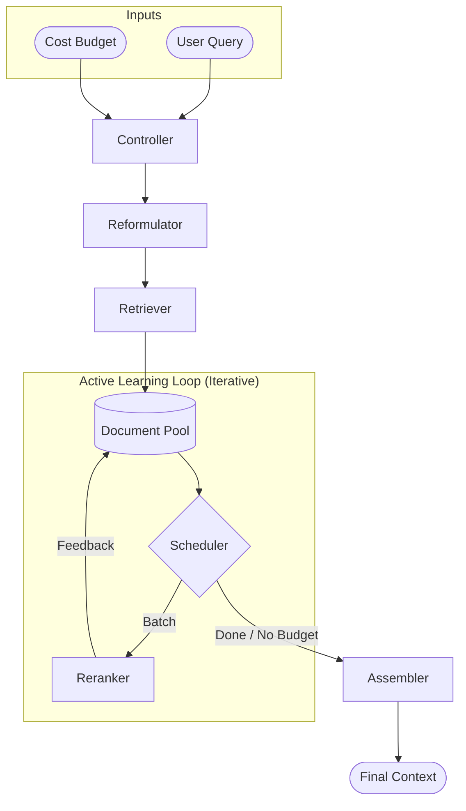

# RAGtune Architecture

RAGtune is a budget-aware middleware designed to sit between your application and various retrieval/reranking backends. It treats **cost** and **latency** as first-class constraints.

## Core Philosophy: Active Learning & Feedback Loops

Unlike traditional RAG pipelines that follow a static "waterfall" (Retrieve -> Rerank -> Final), RAGtune implements an **Active Learning** approach using an iterative feedback loop:

1.  **Sample**: The system picks a small batch of documents.
2.  **Measure**: Ground-truth scores are obtained from expensive rerankers or LLMs.
3.  **Learn**: The **Utility Estimator** updates the predicted utility of the remaining *unranked* documents based on these results.
4.  **Repeat**: The next batch is selected based on this updated belief, continuing until the budget is exhausted.

This allows RAGtune to dynamically discover "hot spots" of relevant information (e.g., specific sections or sources) and prioritize them in real-time.

## Component Architecture

### 1. Controller (`core/controller.py`)
The orchestrator that manages the iterative loop. It handles initialization, calling the scheduler for the next batch, and final context assembly.

### 2. Scheduler (`components/schedulers.py`)
The "Driver". It uses the `UtilityEstimator` to propose the next document batch indices (`BatchProposal`) and decides which reranking strategy to apply.

### 3. Utility Estimator (`components/estimators.py`)
The "Brain". It adapts its predictions of unranked document utility based on the metadata and content of high-scoring documents found in previous rounds.

### 4. CostTracker (`core/budget.py`)
The "Bank". It tracks tokens, latency, and API calls. Every component must call `try_consume_*` to ensure execution stays within the user-defined `CostBudget`.

## Flow Diagram (Mermaid)

> [!NOTE]
> If the diagram below does not render, ensure you are using the **Markdown Preview** (`Cmd+Shift+V`) and that your editor supports Mermaid. I have provided a high-quality static image above for fallback.

## Traceability
Every iteration, decision, and skip (due to budget) is logged in a structured `ControllerTrace`, allowing for complete visibility into *why* specific fragments were chosen for the final context.
