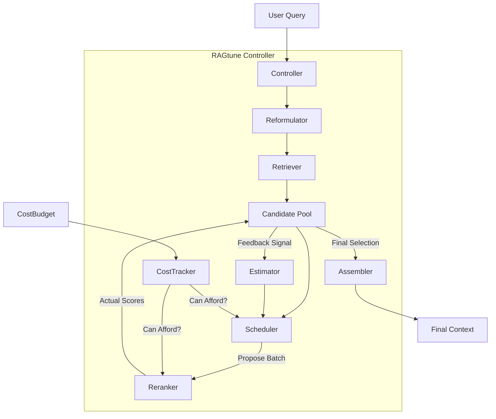

This is the **Official RAGtune Master Plan (v2.1)**. It integrates the **Iterative Scheduler** and **Active Learning** architecture we defined, replacing the linear "gate" model.

This document acts as the single source of truth for the project.

---

# RAGtune: Project Master Plan

**Version:** 2.1 (Iterative Architecture)
**Mission:** To build a **cost-aware, iterative retrieval controller** that optimizes information gain under strict budget constraints.

---

## 1. Core Philosophy

RAGtune is **middleware**. It sits between the user's application and the backend retrieval systems.

* **Budget First:** Every operation (retrieval, reranking, reformulation) must "ask for permission" from a request-scoped `CostTracker`.
* **Iterative Optimization:** Instead of a fixed pipeline, we use a **feedback loop**. The system samples documents, measures their quality (via reranker/LLM), and uses that signal to decide what to fetch or rank next.
* **Graceful Degradation:** When the budget runs out, the loop stops immediately. The system returns the best results found *so far*, ensuring no crashes and no over-spending.
* **Traceability:** Every decision (e.g., "Batch 2 prioritized due to high feedback score") is logged in a structured `ControllerTrace`.

---

## 2. Architecture & Data Flow

### The "Active Loop" Model

We move from a linear waterfall to a stateful loop.

1. **Input:** `Query` + `CostBudget`.
2. **Instantiation:** A `CostTracker` is initialized.
3. **Retrieval:** The `Retriever` fetches a broad candidate pool.
4. **The Loop:**
* **Estimation:** The `Estimator` predicts the utility of unranked docs based on the `Trace` of already-ranked docs.
* **Scheduling:** The `Scheduler` proposes the next `Batch` of documents to rerank.
* **Execution:** The `Reranker` scores the batch. Costs are consumed.
* **Feedback:** New scores update the `Estimator`'s beliefs.


5. **Output:** When budget is exhausted or pool is empty, the `Assembler` selects the final context.

### High-Level Diagram



---

## 3. Directory Structure (Canonical)

This structure includes the new `schedulers` and `estimators` components.

```text
ragtune/
├── pyproject.toml
├── src/
│   └── ragtune/
│       ├── __init__.py
│       │
│       ├── core/                  # THE ORCHESTRATOR (Stable Interfaces)
│       │   ├── types.py           # ScoredDocument, BatchProposal, Trace
│       │   ├── budget.py          # CostTracker, CostBudget
│       │   ├── interfaces.py      # BaseScheduler, BaseRetriever, BaseReranker
│       │   ├── controller.py      # The Iterative "While" Loop
│       │   └── errors.py          # Typed exceptions
│       │
│       ├── components/            # THE ALGORITHMS (Pluggable)
│       │   ├── reformulators/     # Identity, Paraphrase, HyDE
│       │   ├── retrievers/        # InMemory, VectorDB wrappers
│       │   ├── rerankers/         # CrossEncoder, LLM
│       │   ├── estimators.py      # UtilityEstimator (Similarity/Metadata based)
│       │   ├── schedulers.py      # ActiveLearningScheduler
│       │   └── assemblers.py      # Greedy Knapsack
│       │
│       ├── adapters/              # THE TRANSLATORS
│       │   └── langchain/         # RAGtuneRetriever
│       │
│       └── utils/
│           └── tokenizers.py      # Token counting
│
├── tests/
│   ├── conftest.py                # Fake Components (Deterministic)
│   ├── unit/                      # Math & Estimator logic
│   ├── integration/               # Loop mechanics & Degradation
│   └── benchmarks/                # Cost/Accuracy measurement scripts

```

---

## 4. Development Roadmap

### Phase 1: v0.1 - The Foundation (Weeks 1-2)

**Goal:** A working **iterative loop** with "fake" components. It must demonstrate the *mechanism* of proposing batches and stopping when the budget is full.

* **Deliverables:**
1. **Core Types:** `ScoredDocument`, `BatchProposal`, `ControllerTrace`.
2. **The Bank:** `CostTracker` logic.
3. **The Brain (v0.1):** `ActiveLearningScheduler` (logic: pick top unranked) + `UtilityEstimator` (logic: pass-through).
4. **The Orchestrator:** `Controller.run()` implementing the `while True` loop.
5. **The Harness:** Tests proving the loop runs exactly  times allowed by the budget.


* **Exit Criteria:** `pytest` passes. Trace logs show "Batch 1 executed", "Batch 2 executed", "Batch 3 skipped (budget)".

### Phase 2: v0.2 - The Intelligence (Weeks 3-4)

**Goal:** Real logic. The Estimator actually uses feedback to change rankings.

* **Deliverables:**
1. **Smart Estimator:** Implement `SimilarityEstimator` (boost unranked docs similar to highly-scored ranked docs).
2. **Real Rerankers:** `CrossEncoderReranker` (local) and `LLMReranker` (API).
3. **Hybrid Scheduling:** Strategy switching (start with CrossEncoder, escalate to LLM if ambiguous).
4. **Benchmarks:** Run on **HotpotQA**. Show that RAGtune finds the answer with fewer reranker calls than a standard "rerank all" pipeline.


* **Exit Criteria:** Benchmark shows efficient budget utilization (Pareto improvement).

### Phase 3: v0.3 - Production Readiness (Weeks 5-6)

**Goal:** Usability and Core ecosystem support.

* **Deliverables:**
1. **Adapters:** LangChain/LlamaIndex core implementations.
2. **Async:** `arun()` for the loop.
3. **Packaging:** v0.3 alpha release.

* **Status:** [COMPLETED]

### Phase 4: v0.4 - Advanced Integrations & Benchmarking (Weeks 7-10)

**Goal:** Broaden ecosystem reach and provide objective performance metrics.

* **Deliverables:**
1. **PyTerrier Adapter**: Integration for traditional IR researchers.
2. **Hugging Face Integration**: Native loading of the full BRIGHT dataset.
3. **The RAGtune Benchmark**: A standardized test harness to compare different `Estimator` algorithms (Utility vs Similarity) on the BRIGHT test set.
4. **Enhanced Adapters**: Full feature parity for LangChain and LlamaIndex (streaming support, etc.).

* **Exit Criteria**: A public benchmark table showing RAGtune's cost/accuracy Pareto curve on the full BRIGHT dataset.


---

## 5. Technical Specifications (The Contracts)

### A. The Controller Interface

```python
class RAGtuneController:
    def run(self, query: str, budget: Optional[CostBudget] = None) -> ControllerOutput:
        """
        1. Init CostTracker(budget).
        2. Retrieve Candidates -> Populate Pool.
        3. Loop:
           a. Scheduler.propose_next_batch(pool, processed_indices, tracker)
           b. If Proposal is None: Break.
           c. Tracker.try_consume(proposal.cost):
                - If Fail: Break.
                - If Pass: Reranker.rerank(batch).
           d. Update Pool scores (Feedback).
           e. Add indices to processed_indices.
        4. Assemble Final Context.
        5. Return Output + Trace.
        """

```

### B. The Scheduler Interface

```python
class BaseScheduler(ABC):
    @abstractmethod
    def propose_next_batch(
        self,
        pool: List[ScoredDocument],
        processed_indices: List[int],
        tracker: CostTracker
    ) -> Optional[BatchProposal]:
        """
        Returns indices of docs to rerank next.
        Returns None if:
        - Pool is fully processed.
        - Estimator sees no remaining value.
        - Tracker says budget is critical (pre-check).
        """

```

### C. The Batch Proposal

```python
class BatchProposal(BaseModel):
    document_indices: List[int]
    strategy: str                  # "cross_encoder" or "llm"
    estimated_utility: float       # Debug info

```

---

## 6. Testing & Validation Strategy

### Unit Tests (The "Mechanism")

* **`test_active_loop_stops_on_budget`:** Give budget for 5 docs. Pool has 100. Scheduler requests batches of 1. Assert loop runs exactly 5 times.
* **`test_feedback_propagation`:**
* Setup: Doc A and Doc B are "similar" (mocked metadata).
* Action: Rerank Doc A -> High Score.
* Assert: `Estimator` increases score of Doc B in the next cycle.


### Benchmarks (The "Value")

* **Metric:** "Recall @ K Reranked Docs".
* **Scenario:** Can we find the Golden Document by reranking only 10% of the pool?
